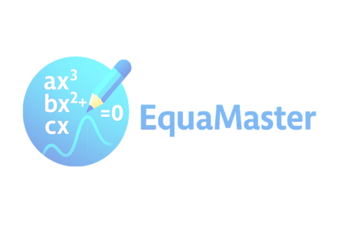

# EquaMaster

EquaMaster – A GUI application for solving linear equations `ax + b = 0`.  
It supports **fraction/decimal input modes**, displays results quickly, includes a **Solve tab**, an **Info tab**, a **progress bar**, and a **resizable window**.



---

## Current Version

**EquaMaster v0.1.0 – Final 0.x Preview**

### Main Features
- Solve linear equations `ax + b = 0`
- Input validation: prevents crashes on empty or invalid entries
- Display main logo (`logo_main.png`)
- Progress bar simulates 25% → 100% completion
- Tabs: **Solve** + **Info** (Version, Build, Status, Date)
- Window is resizable

---

## Folder Structure

```
v0.1.0/
├─ equamaster.py
├─ solver.py
└─ version.py
assets/
└─ logo_main.png
```

---

## Version History

| Version | Date       | Features / Updates |
|---------|------------|------------------|
| 0.1.0   | 06-01-2026 | Initial preview: Solve tab + Info tab, progress bar, resizable window, logo display |

---

## How to Run

1. Install Python 3.10+ and required package:

```
pip install pillow
```

2. Run the main script:

```
python equamaster.py
```

3. Use the **Solve** tab to solve equations, and the **Info** tab to see version information and features.

---

## License

MIT License – see the `LICENSE` file for details.
